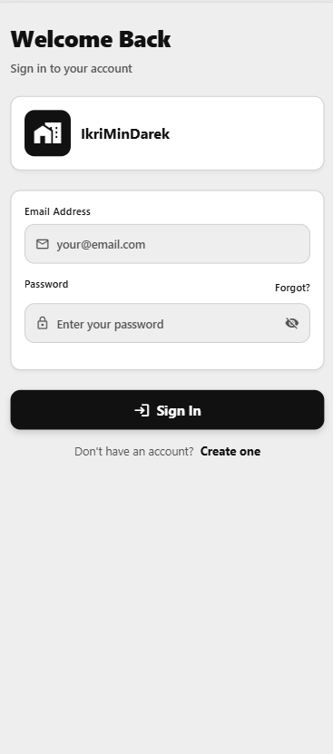
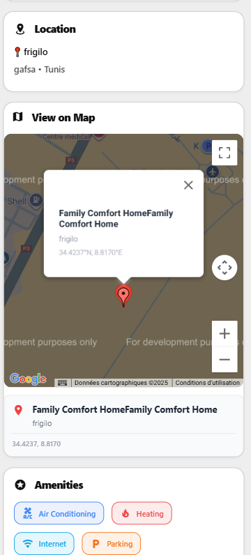
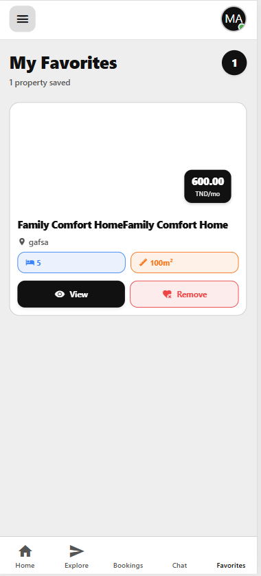
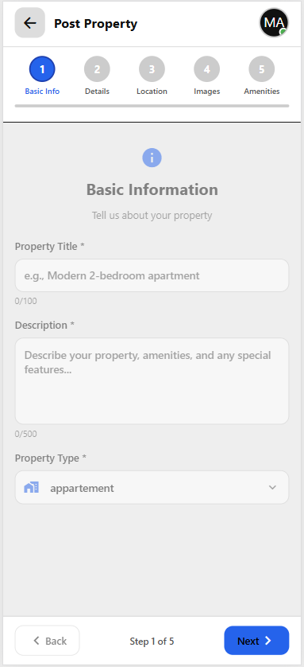
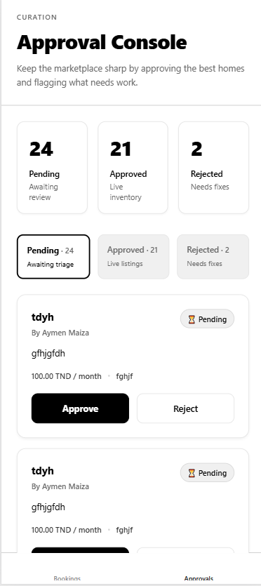
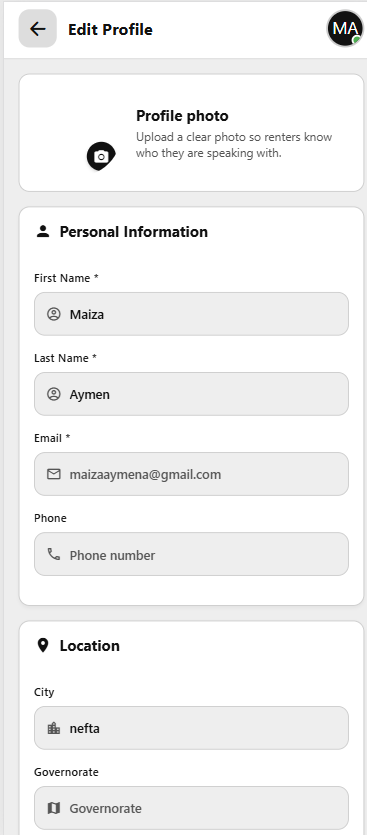

# 🏠 IkriMinDarek - Property Rental Platform










[]()
[]()
[]()
[]()

A modern, full-stack property rental platform built with React Native, Express.js, and PostgreSQL. Users can list properties, search rentals, make bookings, and communicate with landlords in real-time.

## 📋 Table of Contents

- [Overview](#overview)
- [Features](#features)
- [Tech Stack](#tech-stack)
- [Project Structure](#project-structure)
- [Getting Started](#getting-started)
- [Installation](#installation)
- [Configuration](#configuration)
- [Running the Application](#running-the-application)
- [API Documentation](#api-documentation)
- [Database Schema](#database-schema)
- [Architecture](#architecture)
- [Key Features Guide](#key-features-guide)
- [Troubleshooting](#troubleshooting)
- [Contributing](#contributing)
- [License](#license)

---

## 🎯 Overview

IkriMinDarek is a comprehensive property rental platform that connects property owners (landlords) with renters. The application provides:

- **User Management**: Secure authentication and profile management
- **Property Listings**: Browse, search, and filter rental properties with images
- **Booking System**: Reserve properties with date validation and instant confirmation
- **Real-Time Chat**: Direct messaging between renters and landlords
- **Favorites**: Save and manage favorite properties
- **Location Services**: Google Maps integration for property location display
- **Image Management**: Multi-image property uploads and viewing

---

## ✨ Features

### 🔐 Authentication & User Management
- User registration and login with JWT tokens
- Secure password hashing with bcrypt
- Role-based access control (Renter, Landlord, Admin)
- User profile management
- Secure token storage on mobile devices

### 🏠 Property Management
- Create and manage property listings
- Upload multiple property images
- Detailed property information (price, location, amenities)
- Search and filter properties by:
  - Price range
  - Location
  - Availability dates
  - Property type
- Property image gallery view
- Favorites/Wishlist system

### 📅 Booking System
- Create and manage bookings
- Date availability checking
- Booking confirmation and status updates
- Booking history and management
- Real-time booking status notifications

### 💬 Real-Time Chat
- Direct messaging between users
- Socket.IO powered real-time updates
- Message history persistence
- Read receipts and typing indicators
- Online/offline status

### 📍 Location Services
- Google Maps API integration
- Property location display on map
- Geolocation-based property search
- Location sharing between users

### 📱 Cross-Platform Support
- Native iOS/Android mobile app
- Web browser access
- Responsive design
- Platform-specific optimizations

---

## 🛠️ Tech Stack

### Frontend
| Technology | Purpose |
|-----------|---------|
| **React Native** | Cross-platform mobile framework |
| **Expo** | Development and deployment platform |
| **React Navigation** | Screen routing and navigation |
| **Axios** | HTTP client for API calls |
| **Socket.IO Client** | Real-time communication |
| **React Native Maps** | Map integration |
| **Expo Secure Store** | Secure token storage |
| **Expo Router** | File-based routing |

### Backend
| Technology | Purpose |
|-----------|---------|
| **Node.js** | JavaScript runtime |
| **Express.js** | Web framework |
| **Socket.IO** | Real-time bidirectional communication |
| **PostgreSQL** | Relational database |
| **Sequelize** | ORM for database operations |
| **JWT** | Token-based authentication |
| **Bcrypt** | Password hashing |
| **Multer** | File upload handling |
| **Nodemailer** | Email notifications |

### DevOps & Tools
| Tool | Purpose |
|------|---------|
| **Docker** | Containerization |
| **Docker Compose** | Multi-container orchestration |
| **PlantUML** | Architecture diagrams |
| **ESLint** | Code quality |

---

## 📁 Project Structure

```
IkriMinDarek/
├── backend/                          # Backend services
│   ├── auth-service/                 # Main API server
│   │   ├── config/                   # Configuration files
│   │   ├── middleware/               # Express middleware
│   │   ├── models/                   # Sequelize data models
│   │   ├── routes/                   # API route handlers
│   │   ├── migrations/               # Database migrations
│   │   ├── uploads/                  # Uploaded files
│   │   ├── server.js                 # Express server entry
│   │   ├── socket.js                 # Socket.IO configuration
│   │   ├── package.json              # Dependencies
│   │   └── dockerfile                # Docker configuration
│   └── uploads/                      # Uploaded files storage
│
├── client/                           # Frontend applications
│   └── mobile_1/                     # React Native Expo app
│       ├── app/                      # Expo Router app directory
│       ├── components/               # Reusable UI components
│       ├── screens/                  # Screen components
│       ├── context/                  # React Context state
│       ├── services/                 # API and Socket.IO clients
│       ├── utils/                    # Utility functions
│       ├── config/                   # App configuration
│       ├── hooks/                    # Custom React hooks
│       ├── assets/                   # Images and static assets
│       ├── package.json              # Dependencies
│       └── app.json                  # Expo configuration
│
├── C4_Model/                         # Architecture documentation
│   ├── Level1_Context.puml           # System context diagram
│   ├── Level2_Container.puml         # Container architecture
│   ├── Level3_Component_Backend.puml # Backend components
│   ├── Level3_Component_Frontend.puml# Frontend components
│   ├── Level4_Code_Sequences.puml    # Code sequences
│   └── README.md                     # C4 Model documentation
│
├── migrations/                       # Database migration scripts
│   ├── add-booking-chat-fields.sql   # Migration 1
│   └── fix-sender-id-nullable.sql    # Migration 2
│
├── Documentation Files               # Project guides and references
│   ├── QUICK_START.md                # Quick start guide
│   ├── QUICK_REFERENCE.md            # API reference
│   ├── PROJECT_COMPLETION_SUMMARY.md # Project completion status
│   ├── START_HERE_MAPS.md            # Maps integration guide
│   ├── START_HERE_CHAT.md            # Chat feature guide
│   ├── START_HERE_GOOGLE_MAPS.md     # Google Maps setup
│   ├── PLATFORM_SUMMARY.md           # Platform overview
│   └── [More documentation files]
│
├── docker-compose.yml                # Docker Compose configuration
├── package.json                      # Root package configuration
├── LICENSE                           # Project license
└── README.md                         # This file
```

---

## 🚀 Getting Started

### Prerequisites

- **Node.js** v18.0.0 or higher
- **PostgreSQL** v12.0 or higher
- **npm** v8.0.0 or higher
- **Git**
- **Expo CLI** (for mobile development): `npm install -g expo-cli`
- **Google Maps API Key** (for location features)
- **Email Service** credentials (for notifications)

### Quick Start (5 minutes)

```bash
# 1. Clone the repository
git clone <repository-url>
cd IkriMinDarek

# 2. Install backend dependencies
cd backend/auth-service
npm install

# 3. Install frontend dependencies
cd ../../client/mobile_1
npm install

# 4. Set up environment variables (see Configuration section)

# 5. Start the backend server
cd ../../backend/auth-service
npm start

# 6. Start the frontend
cd ../../client/mobile_1
npm start
```

---

## 📦 Installation

### Step 1: Clone the Repository

```bash
git clone https://github.com/MaizaAymen/IkriMinDarek.git
cd IkriMinDarek
```

### Step 2: Backend Setup

```bash
cd backend/auth-service

# Install dependencies
npm install

# Create environment file
cp .env.example .env

# Update .env with your configuration (see Configuration section)

# Run database migrations
npm run migrate

# Start the server
npm start
```

### Step 3: Frontend Setup

```bash
cd client/mobile_1

# Install dependencies
npm install

# Create environment file
cp .env.example .env

# Update .env with backend URL and API keys

# Start Expo development server
npm start
```

### Step 4: Database Setup

```bash
# Create PostgreSQL database
createdb ikrimindarek

# Run migrations
cd backend/auth-service
npm run migrate
```

---

## ⚙️ Configuration

### Backend Environment Variables

Create `.env` file in `backend/auth-service/`:

```env
# Server Configuration
NODE_ENV=development
PORT=4000
HOST=localhost

# Database Configuration
DB_HOST=localhost
DB_PORT=5432
DB_NAME=ikrimindarek
DB_USER=postgres
DB_PASSWORD=your_password

# Authentication
JWT_SECRET=your_super_secret_jwt_key_change_this
JWT_EXPIRE=7d

# Google Maps API
GOOGLE_MAPS_API_KEY=your_google_maps_api_key

# Email Service
EMAIL_SERVICE=gmail
EMAIL_USER=your_email@gmail.com
EMAIL_PASSWORD=your_email_password

# File Upload
UPLOAD_DIR=./uploads
MAX_FILE_SIZE=5242880

# CORS
CORS_ORIGIN=http://localhost:19000,http://localhost:8081

# Socket.IO
SOCKET_IO_CORS_ORIGIN=http://localhost:19000,http://localhost:8081
```

### Frontend Environment Variables

Create `.env` file in `client/mobile_1/`:

```env
# API Configuration
EXPO_PUBLIC_API_URL=http://localhost:4000/api
EXPO_PUBLIC_API_BASE_URL=http://localhost:4000

# Socket.IO
EXPO_PUBLIC_SOCKET_URL=http://localhost:4000

# Google Maps
EXPO_PUBLIC_GOOGLE_MAPS_API_KEY=your_google_maps_api_key

# App Configuration
EXPO_PUBLIC_APP_NAME=IkriMinDarek
```

---

## ▶️ Running the Application

### Option 1: Development Mode

**Terminal 1 - Backend:**
```bash
cd backend/auth-service
npm start
```

**Terminal 2 - Frontend:**
```bash
cd client/mobile_1
npm start
```

Then press:
- `i` for iOS simulator
- `a` for Android emulator
- `w` for web browser
- `j` to open Expo DevTools

### Option 2: Using Docker

```bash
# Start all services with Docker Compose
docker-compose up

# Backend runs on http://localhost:4000
# Database: PostgreSQL on localhost:5432
```

### Option 3: Production Build

**Frontend:**
```bash
cd client/mobile_1

# For iOS
eas build --platform ios

# For Android
eas build --platform android

# For Web
npm run build
```

**Backend:**
```bash
cd backend/auth-service

# Build Docker image
docker build -t ikrimindarek-backend .

# Run container
docker run -p 4000:4000 --env-file .env ikrimindarek-backend
```

---

## 📚 API Documentation

### Authentication Endpoints

```http
POST   /api/auth/register      # Register new user
POST   /api/auth/login         # User login
GET    /api/auth/profile       # Get user profile
PUT    /api/auth/profile       # Update user profile
POST   /api/auth/logout        # User logout
POST   /api/auth/refresh-token # Refresh JWT token
```

### Property Endpoints

```http
GET    /api/properties                  # Get all properties
GET    /api/properties/:id              # Get property details
GET    /api/properties/search           # Search properties
POST   /api/properties                  # Create property
PUT    /api/properties/:id              # Update property
DELETE /api/properties/:id              # Delete property
GET    /api/properties/:id/images       # Get property images
POST   /api/properties/:id/images       # Upload property images
```

### Booking Endpoints

```http
GET    /api/bookings                    # Get user bookings
POST   /api/bookings                    # Create booking
GET    /api/bookings/:id                # Get booking details
PUT    /api/bookings/:id                # Update booking
DELETE /api/bookings/:id                # Cancel booking
PUT    /api/bookings/:id/accept         # Accept booking (landlord)
PUT    /api/bookings/:id/reject         # Reject booking (landlord)
```

### Chat Endpoints

```http
GET    /api/messages                    # Get all messages
GET    /api/messages/:userId            # Get chat history
POST   /api/messages                    # Send message
PUT    /api/messages/:id/read           # Mark as read
```

### Favorites Endpoints

```http
GET    /api/favorites                   # Get user favorites
POST   /api/favorites/:propertyId       # Add to favorites
DELETE /api/favorites/:propertyId       # Remove from favorites
```

**Complete API documentation**: See [QUICK_REFERENCE.md](./QUICK_REFERENCE.md)

---

## 🗄️ Database Schema

### Core Tables

**Users**
```sql
id, email, password, first_name, last_name, 
phone, avatar, role, created_at, updated_at
```

**Properties**
```sql
id, owner_id, title, description, price_per_night,
address, location, amenities, created_at, updated_at
```

**Bookings**
```sql
id, property_id, renter_id, check_in_date, 
check_out_date, status, total_price, created_at, updated_at
```

**Messages**
```sql
id, sender_id, receiver_id, content, 
is_read, created_at, updated_at
```

**Favorites**
```sql
id, user_id, property_id, created_at
```

**PropertyImages**
```sql
id, property_id, image_url, upload_date
```

**Database Diagram**: See [C4_Model/Level3_Component_Backend.puml](./C4_Model/Level3_Component_Backend.puml)

---

## 🏗️ Architecture

The application follows a modern 3-tier architecture:

```
┌─────────────────────────────────────┐
│     CLIENT TIER (React Native)      │
│  - Mobile App (iOS/Android)         │
│  - Web App (Browser)                │
└──────────────┬──────────────────────┘
               │ HTTPS / REST API
┌──────────────▼──────────────────────┐
│   API & MIDDLEWARE TIER             │
│  - Express.js Server (Port 4000)    │
│  - JWT Authentication               │
│  - CORS Configuration               │
└──────────────┬──────────────────────┘
               │ Routes
┌──────────────▼──────────────────────┐
│   BUSINESS LOGIC TIER               │
│  - Auth Service                     │
│  - Property Service                 │
│  - Booking Service                  │
│  - Chat Service                     │
│  - Favorites Service                │
└──────────────┬──────────────────────┘
               │ SQL Queries
┌──────────────▼──────────────────────┐
│   DATA PERSISTENCE TIER             │
│  - PostgreSQL Database              │
│  - File Storage (Images)            │
└─────────────────────────────────────┘
```

**Detailed architecture diagrams**: See [C4_Model/README.md](./C4_Model/README.md)

---

## 🎯 Key Features Guide

### Authentication
- JWT-based token authentication
- Secure password hashing with bcrypt (10 rounds)
- Token refresh mechanism
- Secure token storage using Expo SecureStore

**Guide**: [START_HERE_AUTH.md](./QUICK_START_AUTH.md)

### Property Listing & Search
- Advanced search filters
- Multiple image uploads
- Property details and amenities
- Real-time availability checking

**Guide**: [QUICK_POST_PROPERTY.md](./QUICK_POST_PROPERTY.md)

### Booking System
- Date conflict validation
- Instant confirmation
- Real-time status updates
- Booking history

**Guide**: [PROPERTY_POSTING_READY.md](./PROPERTY_POSTING_READY.md)

### Real-Time Chat
- Socket.IO powered messaging
- Message persistence
- Online/offline status
- Read receipts

**Guide**: [START_HERE_CHAT.md](./START_HERE_CHAT.md)

### Location Services
- Google Maps integration
- Property location display
- Geolocation-based search

**Guide**: [START_HERE_GOOGLE_MAPS.md](./START_HERE_GOOGLE_MAPS.md)

---

## 🐛 Troubleshooting

### Backend Issues

**Port already in use**
```bash
# Find process using port 4000
lsof -i :4000

# Kill the process
kill -9 <PID>
```

**Database connection error**
```bash
# Check PostgreSQL is running
psql -U postgres

# Verify credentials in .env file
# Ensure database exists: createdb ikrimindarek
```

**JWT token errors**
```bash
# Regenerate JWT secret in .env
# Clear browser/app cache and localStorage
# Log in again with new token
```

### Frontend Issues

**Expo won't start**
```bash
# Clear cache
expo start --clear

# Reinstall dependencies
rm -rf node_modules package-lock.json
npm install
```

**API connection fails**
```bash
# Check API_URL in .env matches backend server
# Ensure backend is running on port 4000
# Check network connectivity and CORS settings
```

**Maps not showing**
```bash
# Verify Google Maps API Key in .env
# Check API key has Maps permissions enabled
# Ensure location permission is granted
```

**Socket.IO connection issues**
```bash
# Verify SOCKET_URL in .env
# Check backend Socket.IO is running
# Look for WebSocket errors in console
```

---

## 🤝 Contributing

1. **Fork** the repository
2. **Create** a feature branch: `git checkout -b feature/amazing-feature`
3. **Commit** changes: `git commit -m 'Add amazing feature'`
4. **Push** to branch: `git push origin feature/amazing-feature`
5. **Open** a Pull Request

### Code Style

- Follow ESLint configuration
- Use TypeScript for type safety
- Write meaningful commit messages
- Add comments for complex logic
- Update documentation when adding features

---

## 📞 Support & Contact

For issues, questions, or suggestions:

- **GitHub Issues**: [IkriMinDarek/issues](https://github.com/MaizaAymen/IkriMinDarek/issues)
- **Email**: aymen.maiza@example.com
- **Documentation**: See files in repository root

---

## 📄 License

This project is licensed under the MIT License - see [LICENSE](./LICENSE) file for details.

---

## 📝 Changelog

### Version 1.0.0 (December 2025)
- ✅ User authentication and authorization
- ✅ Property listing and management
- ✅ Booking system with date validation
- ✅ Real-time chat functionality
- ✅ Google Maps integration
- ✅ Image upload and management
- ✅ Favorites/Wishlist system
- ✅ Cross-platform support (iOS, Android, Web)

---

## 🔗 Quick Links

| Link | Description |
|------|-------------|
| [Architecture Diagrams](./C4_Model/README.md) | C4 model architecture |
| [API Reference](./QUICK_REFERENCE.md) | Complete API documentation |
| [Quick Start](./QUICK_START.md) | 5-minute setup guide |
| [Chat Integration](./START_HERE_CHAT.md) | Chat feature setup |
| [Maps Integration](./START_HERE_GOOGLE_MAPS.md) | Google Maps setup |
| [Project Status](./PROJECT_COMPLETION_SUMMARY.md) | Current project status |

---

**Last Updated**: December 2025
**Version**: 1.0.0
**Status**: Production Ready ✅

---

*IkriMinDarek - Making property rental simple, secure, and social.* 🏠